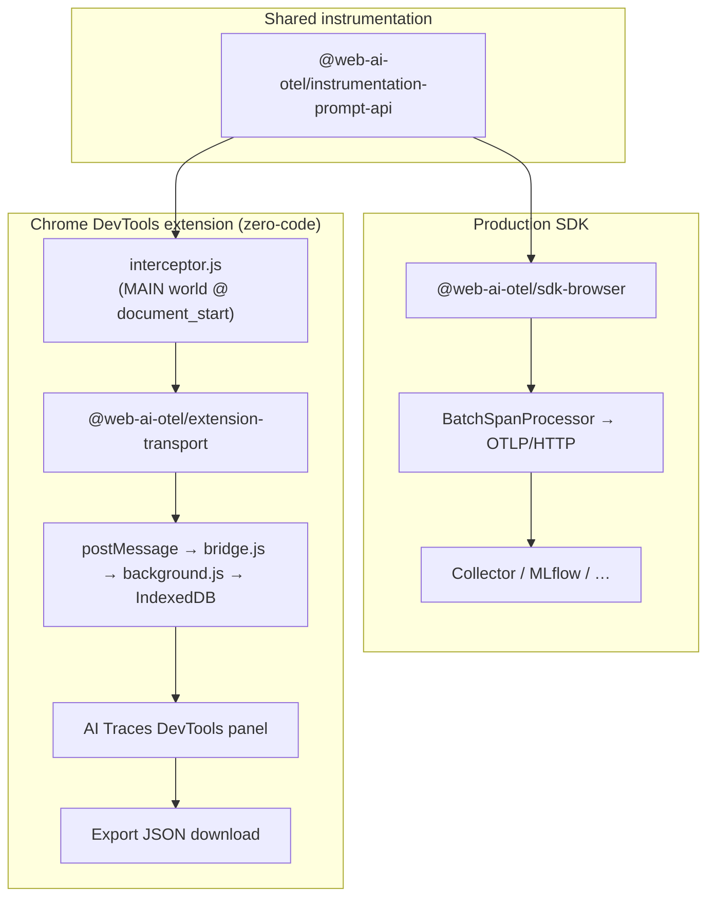
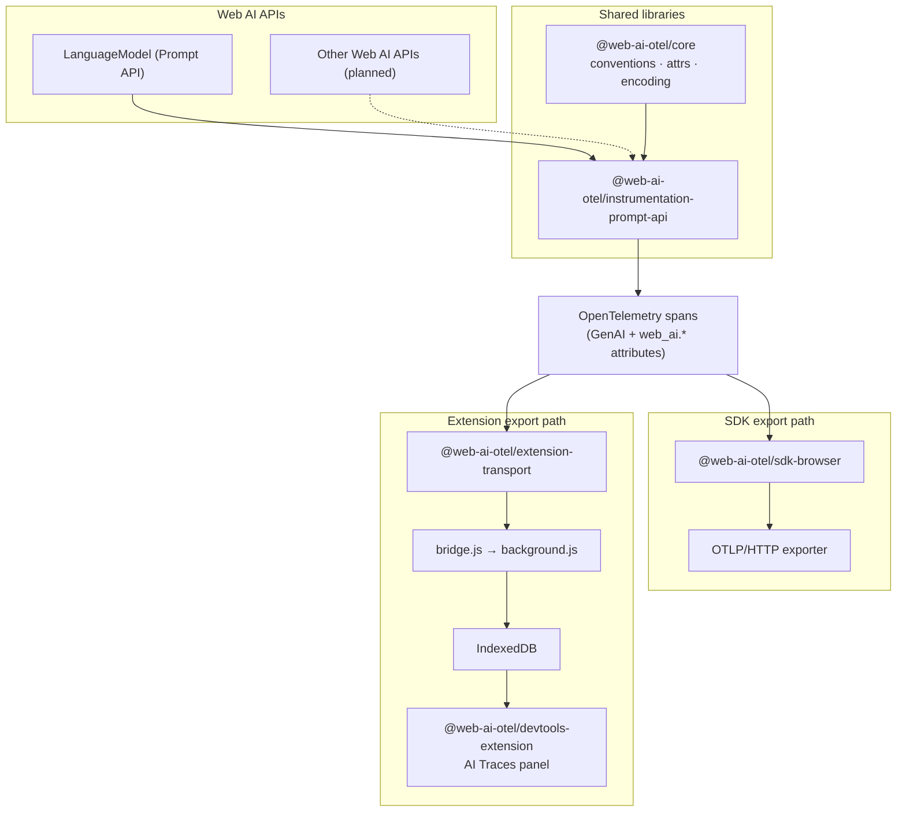

# Web AI OpenTelemetry

OpenTelemetry instrumentation for browser Web AI APIs. One shared instrumentation library, two ways to run it: a production browser SDK, or a Chrome DevTools extension that instruments pages without code changes.

Browser-local AI runs inside the page. Network-level observability never sees the prompts, the model calls, or context window usage. This project instruments the Web AI APIs directly and exports standard OpenTelemetry spans.

## Two usage modes

Both paths share `@web-ai-otel/instrumentation-prompt-api` and emit standard OpenTelemetry spans; they diverge at export.



## Architecture



OpenTelemetry is the canonical telemetry model. MLflow, Langfuse, Grafana, Phoenix, and other backends are export destinations, not internal trace formats.

## Current support

| API | Status |
| --- | --- |
| Prompt API (`LanguageModel`) | Initial implementation |
| Summarizer API | Planned |
| Writer API | Planned |
| Rewriter API | Planned |
| Translator API | Planned |
| Language Detector API | Planned |
| Semantic Embedder API | Planned |
| WebMCP | Future exploration |

## Quick start

### Prerequisites

- Node.js 22.18+, 24.11+, or 26+ (required for `tsdown` builds; see `.nvmrc`)
- pnpm 12+
- Chrome with Prompt API support (for live testing)

### Install

```bash
cd built-in-ai-observability
pnpm install
pnpm build
```

### Production SDK

```typescript
import { WebAISDK } from "@web-ai-otel/sdk-browser";

const sdk = new WebAISDK({
  serviceName: "my-app",
  otlpUrl: "http://localhost:4318/v1/traces",
  captureInput: false,
  captureOutput: false,
});

await sdk.start();

// Use LanguageModel as usual — calls are traced automatically.
const session = await LanguageModel.create({ … });
```

See `examples/vanilla/` for a minimal app.

### DevTools extension

```bash
pnpm build:extension
```

Load `apps/devtools-extension/dist` as an unpacked extension in Chrome. Open DevTools on any page using the Prompt API and select the **AI Traces** panel.

The extension injects instrumentation at `document_start` in the MAIN world, before application code can capture references to the original API. Installation is fully synchronous for that reason — nothing is awaited before `LanguageModel` is patched.

The panel only shows traces recorded for the tab you are inspecting; attribution comes from the message sender rather than the page, so it cannot be spoofed by page scripts. Traces are dropped when their tab closes, and the newest 2000 traces per profile are retained.

The injected provider is deliberately **not** registered as the page's global OpenTelemetry provider, so the extension never disturbs an app's own OpenTelemetry setup.

### Playground

```bash
pnpm dev:playground
```

- Default: SDK mode, exporting OTLP to a collector on `localhost:4318`
- Extension-only: `?sdk=false` (no SDK; use the extension)
- MLflow: `?experiment=<id>` exports to a local MLflow instead, which ingests OTLP directly and renders the traces from the attributes we already emit. `?otlp=<url>` points anywhere else.

```bash
pnpm mlflow   # http://localhost:5000, then open ?experiment=0
```

## Packages

| Package | Purpose |
| --- | --- |
| `@web-ai-otel/core` | Semantic conventions, types, message encoding, browser runtime attrs |
| `@web-ai-otel/instrumentation-prompt-api` | Host-agnostic `LanguageModel` instrumentation |
| `@web-ai-otel/sdk-browser` | Production browser SDK |
| `@web-ai-otel/extension-transport` | Span exporter for extension `postMessage` bridge |

## Semantic conventions

Inference spans follow [OpenTelemetry GenAI conventions](https://github.com/open-telemetry/semantic-conventions-genai) where they apply. Browser-specific gaps use experimental `web_ai.*` attributes (context window usage, streaming chunk count, model download state, session config, and similar).

Context window measurements are **not** mapped to `gen_ai.usage.*` token counts. The Prompt API reports context occupancy, not per-request token billing.

Every span carries `web_ai.api.name` so traces stay attributable once more Web AI APIs are instrumented. Spans emitted per session:

| Span | When |
| --- | --- |
| `web_ai.create_session` | `LanguageModel.create()`, including model download state |
| `web_ai.check_availability` | `LanguageModel.availability()` |
| `invoke_agent` | Wraps a question answered with tools; see [Traces and sessions](#traces-and-sessions) |
| `generate_content` | `prompt()` and `promptStreaming()` |
| `execute_tool <name>` | A tool the page ran, reconstructed from the call and its response |
| `web_ai.clone_session` | `clone()`; keeps `gen_ai.conversation.id`, new session id |
| `web_ai.destroy_session` | `destroy()` |

### Model download state

`web_ai.model.download_observed` is only set when a `downloadprogress` event reports *fractional* progress. Chrome fires `loaded: 0` immediately followed by `loaded: 1` even when the model is already on disk, so treating the first event as a download start reports one on every `create()`. `web_ai.model.download_duration` and the `web_ai.model.download_complete` event are likewise emitted only once real progress is seen; an instantaneous download is therefore reported as no download rather than a phantom one.

## Traces and sessions

A trace is one question and its answer. On a session without tools that is a single `generate_content` span. On a session with tools, answering can take several model turns with tool runs in between, and the whole thing is one trace rooted on an `invoke_agent` span:

```
invoke_agent                       "What is the weather and the population of Kyoto?"
├── generate_content               asks for two tools
├── execute_tool get_weather
├── execute_tool get_population
└── generate_content               "The weather in Kyoto is light rain…"
```

The turns and tool runs are **siblings**, not nested: they happen one after another, so a turn does not run inside the turn before it and a tool does not run inside the turn that asked for it — that turn has already ended. Nesting them would produce children outliving their parents, which reads as a broken timeline.

The root exists because a trace is summarised from its root, and the answer only arrives on the last turn. Without it, a backend would preview the exchange by the first turn's output, which is a tool call rather than an answer. The root therefore carries the user's question as its input, the final text as its output, and `web_ai.exchange.turn_count` / `web_ai.exchange.tool_call_count`. An exchange the page never returns tool results for is closed on the next question or on `destroy()` and marked `web_ai.exchange.abandoned`.

Conversation-level context comes from the **session**, which spans more than one exchange: every span carries `gen_ai.conversation.id` (mirrored to `session.id` and `web_ai.session.id`), and clones inherit the conversation while getting a fresh `web_ai.session.id` plus `web_ai.session.parent_id`.

The DevTools panel therefore lists every trace newest first — root span name, request/response previews, span count, tool calls and duration — with a **Group by session** toggle that collapses them under their `gen_ai.conversation.id`, each group showing turn count, duration, context-window usage and errors. This follows MLflow, which retired its separate sessions view in favour of the same toggle. Spans without a conversation (such as `web_ai.check_availability`) stay listed on their own when grouped.

Selecting a trace opens a slide-in detail sheet over the list (with a dimmed list peek on the left), so the request and response get most of the panel width even when DevTools is docked to the side. The sheet stacks a span timeline above the detail of the selected span: one row per span with a proportional bar against the trace's own window, nesting shown by indentation, and arrows in the header to step through neighbouring traces. A nested list is available as an alternative view, and a single-span trace skips the section entirely.

The list is scoped to the tab you are inspecting, and the header shows which tab and origin that is.

Stored data is a disposable local cache: traces (with their spans) and sessions are each capped independently and pruned oldest-first, and closing a tab clears its traces.

Parents are threaded explicitly through `SessionState` rather than taken from ambient context, since the extension's injected provider is not registered globally and so has no context manager.

## Known limitations

- **The MAIN-world → extension channel is page-observable.** The instrumented page must hand spans to the isolated world via `postMessage`, so other scripts on the page can observe them. The page already owns this data, but on pages with third-party scripts, prefer leaving content capture off. Payloads are structurally validated before they reach the privileged extension context.
- **Chrome does not support async iteration of `ReadableStream`.** Consume `promptStreaming()` with `getReader()`.
- **Token usage is unavailable.** The Prompt API exposes no per-request token counts.

## Privacy

- `captureInput` / `captureOutput` control prompt and response content in spans
- SDK defaults: content capture off
- DevTools extension defaults: content capture on (local debugging)
- Image and audio parts are never exported as bytes; they are redacted

Telemetry never leaves the browser unless you configure an exporter or explicitly export from DevTools.

## Development

```bash
pnpm dev        # watch mode (packages)
pnpm build      # build all packages
pnpm test       # run tests
pnpm typecheck  # tsc across every package and app
pnpm check      # lint + format check (full repo)
pnpm format     # auto-fix lint and formatting (full repo)

# Apps and examples
pnpm dev:playground
pnpm dev:vanilla
pnpm dev:extension
pnpm build:extension
pnpm mlflow     # local MLflow server for trace viewing
```

Pre-commit hooks ([Lefthook](https://lefthook.dev/)) run Biome on **staged** files automatically after `pnpm install`. Run the hook manually with `pnpm precommit`; check the full repo with `pnpm check`. For emergencies: `git commit --no-verify`.

Lint rules come from [Ultracite](https://github.com/haydenbleasel/ultracite) via `biome.jsonc`, but the scripts call Biome directly because `ultracite check` currently fails to render diagnostics.

Ambient Prompt API types live in `types/prompt-api.d.ts` and are shared by every package that needs them, rather than relying on `@types/dom-chromium-ai`. That package is the better long-term home, and covers the task APIs we have not instrumented yet, but its tool types still describe the design where a tool carries an `execute` callback for the browser to invoke. See the file header for why the two cannot be mixed, and switch as soon as the package catches up.

### Working around a moving API

Tool use is still changing in Chrome, so a few things here exist only to cope with today's behaviour and should be deleted once it settles:

- Tool objects keep every field on the prototype, so `Object.keys()` sees nothing and `JSON.stringify()` yields `{}`. `packages/core/src/attributes/tools.ts` reads each field by name instead.
- `callID` comes back as an empty string, even for several calls in one turn, so responses are paired with calls by tool name and request order (`takePendingCall` in `packages/instrumentation-prompt-api/src/tool-spans.ts`).
- Chrome rejects a tool result containing a JSON `null` at any depth, which the playground strips in `apps/playground/tools.ts`.
- An `execute_tool` span is reconstructed from the outside, because the tool runs in page code the instrumentation never sees.

## Relationship to the PoC

This repo refactors concepts from `web-ai-demos/prompt-api-observability/`. The PoC used an explicit `createInstrumentedSession()` wrapper; this project patches `LanguageModel` globally so the same instrumentation works in both SDK and extension modes.

See `docs/implementation-proposal.md` for design decisions.

## License

Apache-2.0
