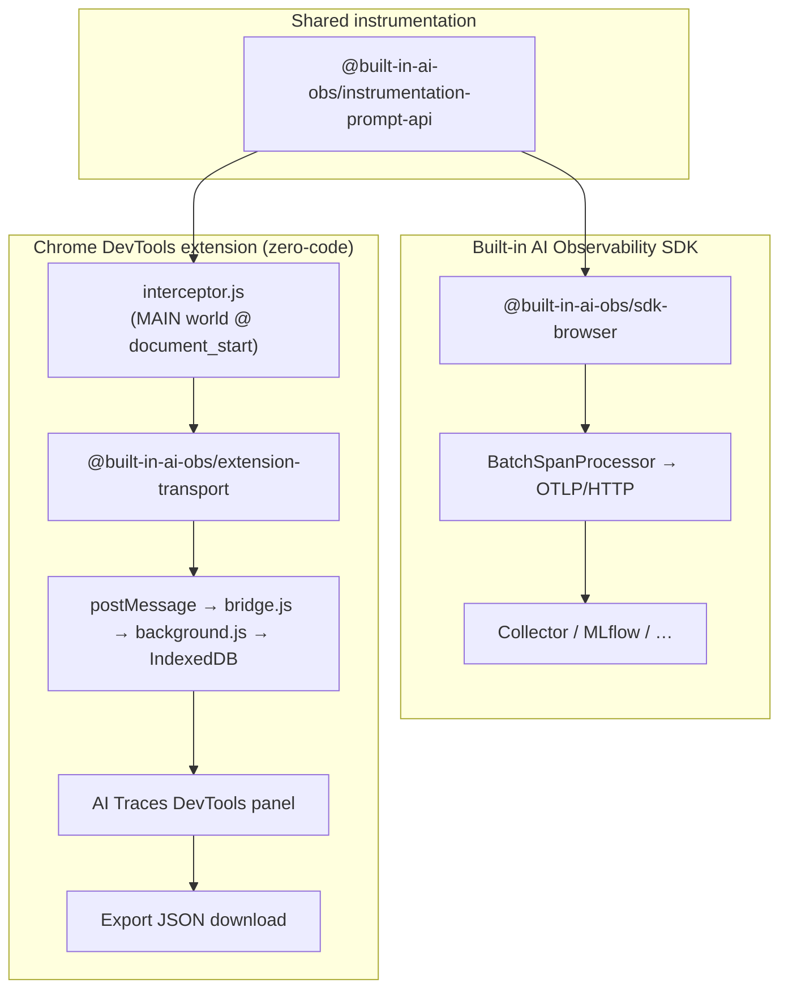
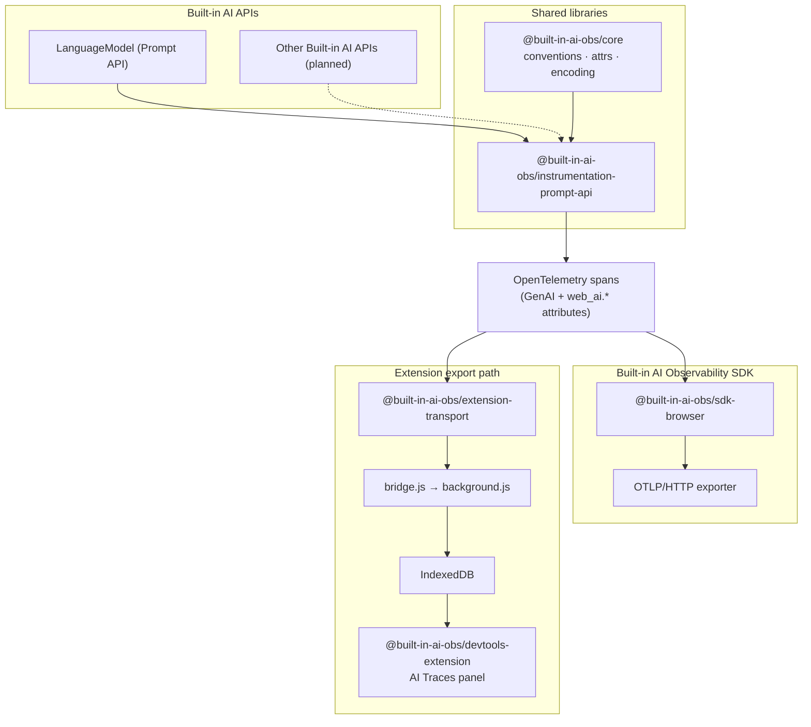

# Telemetry reference

Span names, attributes, multimodal encoding, trace layout, and known API quirks.

## Contents

- [Semantic conventions](#semantic-conventions)
- [Multimodal content](#multimodal-content)
- [Traces and sessions](#traces-and-sessions)
- [Extension pipeline](#extension-pipeline)
- [Known limitations](#known-limitations)
- [Working around a moving API](#working-around-a-moving-api)

## Two usage modes

Both paths share `@built-in-ai-obs/instrumentation-prompt-api` and emit standard OpenTelemetry spans and diverge at export.




## Architecture




OpenTelemetry is the canonical telemetry model. MLflow, Langfuse, Grafana, Phoenix, and other backends are export destinations, not internal trace formats.

## Semantic conventions

Inference spans follow [OpenTelemetry GenAI conventions](https://github.com/open-telemetry/semantic-conventions-genai) where they apply. Browser-specific gaps use experimental `web_ai.*` attributes: context window usage, streaming chunk count, model download state, session config, and similar.

Context window measurements are not mapped to `gen_ai.usage.*` token counts. The Prompt API reports context occupancy, not per-request token billing.

Every span carries `web_ai.api.name` so traces stay attributable once more Built-in AI APIs are instrumented.


| Span                        | When                                                                            |
| --------------------------- | ------------------------------------------------------------------------------- |
| `web_ai.create_session`     | `LanguageModel.create()`, including model download state                        |
| `web_ai.check_availability` | `LanguageModel.availability()`                                                  |
| `invoke_agent`              | A question answered with tools; see [Traces and sessions](#traces-and-sessions) |
| `generate_content`          | `prompt()` and `promptStreaming()`                                              |
| `execute_tool <name>`       | A tool the page ran, reconstructed from the call and its response               |
| `web_ai.clone_session`      | `clone()`; keeps `gen_ai.conversation.id`, new session id                       |
| `web_ai.destroy_session`    | `destroy()`                                                                     |


`session.append()` is not instrumented yet.

### GenAI attributes

On inference spans (`generate_content`, tool spans): `gen_ai.provider.name`, `gen_ai.conversation.id`, `gen_ai.request.stream`, `gen_ai.output.type`, `gen_ai.input.messages`, `gen_ai.output.messages`, `gen_ai.response.finish_reasons`, `gen_ai.response.time_to_first_chunk`, `gen_ai.conversation.compacted`, and tool-related `gen_ai.tool.*` attributes when tools are in play.

Not set by design: `gen_ai.request.model` and `gen_ai.usage.*`. The Prompt API exposes no model id or per-request token counts.

### web_ai attributes


| Attribute                               | Purpose                                             |
| --------------------------------------- | --------------------------------------------------- |
| `web_ai.api.name`                       | Which Built-in AI API produced the span             |
| `web_ai.availability.status`            | Result of `availability()`                          |
| `web_ai.context.window_tokens`          | Context window size                                 |
| `web_ai.context.usage_*`                | Before/after/delta/remaining/utilization            |
| `web_ai.context.overflowed`             | Compaction indicator                                |
| `web_ai.conversation.turn_index`        | Turn order within a session                         |
| `web_ai.conversation.turn_continuation` | Turn carries tool responses from an earlier turn    |
| `web_ai.exchange.*`                     | Totals and abandonment on `invoke_agent`            |
| `web_ai.model.download_*`               | Model download progress and duration                |
| `web_ai.request.sampling_mode`          | Prompt API sampling config                          |
| `web_ai.runtime.browser.*`              | Browser name and version                            |
| `web_ai.runtime.device_memory_gib`      | Coarse hardware hint                                |
| `web_ai.session.*`                      | Session id, parent id, expected inputs/outputs      |
| `web_ai.stream.chunk_count`             | Streaming chunk count                               |
| `web_ai.tool.*`                         | Tool declarations and per-turn call/response counts |


`gen_ai.conversation.id`, `session.id`, and `web_ai.session.id` carry the same value. Clones keep the conversation id and get a new `web_ai.session.id` with `web_ai.session.parent_id` pointing at the source.

### Model download state

`web_ai.model.download_observed` is set only when a `downloadprogress` event reports fractional progress. Chrome fires `loaded: 0` followed by `loaded: 1` even when the model is already on disk. Treating the first event as a download start would report a download on every `create()`.

`web_ai.model.download_duration` and the `web_ai.model.download_complete` event are emitted only after real progress. An instantaneous download is reported as no download, not a phantom one.

## Multimodal content

Image and audio parts are encoded twice because the two readers want different shapes.

`gen_ai.input.messages` records that a turn carried media and nothing more:

```json
{ "type": "redacted", "modality": "audio" }
```

`mlflow.spanInputs` is written only when `includeMlflowPreview` and `captureMultimodalPreview` are both on. It uses an OpenAI-shaped content part with an inline preview. MLflow and the DevTools panel turn that into a thumbnail or audio player:

```json
{ "type": "input_audio", "input_audio": { "data": "UklGR…", "format": "wav" } }
```

Previews are re-encoded, never passed through. Images become JPEG thumbnails capped at 320 px. Audio is decoded and resampled to 16 kHz mono 16-bit PCM WAV. MLflow renders a player only for `wav` or `mp3`. The browser can encode WebM/Opus via `MediaRecorder` or raw PCM via Web Audio, but not Opus or MP3 directly. Exporting WebM as-is makes MLflow dump raw base64.

WAV is roughly 32 KB per second. Defaults: `multimodalPreviewMaxBytes` is 200 KB for audio (about five seconds) and 512 KB for images. `maxMlflowMediaPreviewLength` caps the finished attribute at 1 MB, separate from `maxAttributeLength` (32 KB for text). Reusing the text limit strips media back out. If a preview still overflows, bytes drop before JSON truncation so the attribute stays parseable.

WebM decoding is async and cannot run while span attributes are assembled. The preview attaches after the span opens, in parallel with `prompt()`. If the span ends first, GenAI attributes stay redacted.

## Traces and sessions

A trace is one question and its answer. Without tools, that is a single `generate_content` span. With tools, the whole exchange is one trace rooted on `invoke_agent`:

```
invoke_agent                       "What is the weather and the population of Kyoto?"
├── generate_content               asks for two tools
├── execute_tool get_weather
├── execute_tool get_population
└── generate_content               "The weather in Kyoto is light rain…"
```

Turns and tool runs are siblings, not nested. They run one after another. A turn does not wrap the turn before it, and a tool does not wrap the turn that requested it. Nesting would produce children that outlive their parents.

An `execute_tool` span is paired with the call it answers by `callId`, which it carries as `gen_ai.tool.call.id`, the same id as the `tool_call` part on the turn that asked. Chrome currently sends an empty `callId`, which falls back to a generated id (see [Working around a moving API](#working-around-a-moving-api)). A response that matches no pending call still gets a span, but without the call's arguments, and it starts at the moment the response arrived.

The root span exists because backends summarize a trace from its root, and the answer arrives on the last turn. Without a root, the first turn's output (a tool call) would stand in for the answer. The root carries the user's question as input, the final text as output, and `web_ai.exchange.turn_count` / `web_ai.exchange.tool_call_count`. If the page never returns tool results, the exchange closes on the next question or on `destroy()` and is marked `web_ai.exchange.abandoned`.

The session spans more than one exchange. Every span carries `gen_ai.conversation.id` (mirrored to `session.id` and `web_ai.session.id`). Clones inherit the conversation and get a fresh `web_ai.session.id` plus `web_ai.session.parent_id`.

The DevTools panel lists traces newest first: root span name, request/response previews, span count, tool calls, duration. **Group by session** collapses traces under `gen_ai.conversation.id` with turn count, duration, context-window usage, and errors. Spans without a conversation (such as `web_ai.check_availability`) stay listed on their own when grouped.

Selecting a trace opens a detail sheet over the list. The sheet shows a span timeline and the selected span's detail. A single-span trace skips the timeline. The list is scoped to the tab you are inspecting.

Stored data is a local cache. Traces and sessions are capped independently and pruned oldest-first. Closing a tab clears its traces.

Parents are threaded through `SessionState` rather than ambient OpenTelemetry context. The extension's injected provider is not registered globally and has no context manager.

## Extension pipeline

The Built-in AI Observability SDK and the extension share `PromptApiInstrumentation`. The SDK registers a `WebTracerProvider` with an OTLP exporter. The extension registers a minimal provider with `ExtensionSpanExporter` in the MAIN world at `document_start`.

```text
MAIN world (interceptor.js)
  → ExtensionSpanExporter.onEnd(span)
  → postMessage({ type: "built-in-ai-obs:span", payload })

ISOLATED content script (bridge.js)
  → validate schema, ignore unknown page messages
  → chrome.runtime.sendMessage

Service worker (background.js)
  → append to IndexedDB
  → notify DevTools panel

DevTools panel
  → query IndexedDB, render trace list and span detail
```

Messages use `protocolVersion: 2`. Only `built-in-ai-obs:*` types are accepted. The bridge attaches `tabId`, `frameId`, `url`, and `origin` from Chrome APIs.

## Known limitations

- **The MAIN-world to extension channel is page-observable.** Spans reach the isolated world via `postMessage`, so other scripts on the page can observe them. The page already owns this data, but on pages with third-party scripts, leave content capture off. Payloads are structurally validated before they reach the extension.
- **Chrome does not support async iteration of** `ReadableStream`**.** Consume `promptStreaming()` with `getReader()`.
- **Token usage is unavailable.** The Prompt API exposes no per-request token counts.


## Working around a moving API

Tool use is still changing in Chrome. These workarounds should be deleted once behavior stabilizes:

- Tool objects keep fields on the prototype, so `Object.keys()` sees nothing and `JSON.stringify()` yields `{}`. `packages/core/src/attributes/tools.ts` reads each field by name instead.
- The spec requires a non-empty `callId`, but Chrome 157 still returns `""`, even for several calls in one turn. A call without one is given a generated id (`<session id>-<n>`), and a response without one pairs by tool name and request order, but only with calls that also arrived without an id (`registerToolCalls` and `takePendingCall` in `packages/instrumentation-prompt-api/src/tool-spans.ts`). Once Chrome sends real ids, they are used as is and this path goes unused.
- Chrome rejects a tool result containing JSON `null` at any depth. The playground strips those in `apps/playground/tools.ts`.
- An `execute_tool` span is reconstructed from the outside because the tool runs in page code the instrumentation never sees.

Ambient Prompt API types live in `types/prompt-api.d.ts` rather than `@types/dom-chromium-ai`. That package is the better long-term home and covers task APIs we have not instrumented yet, but its tool types still describe a design where the browser invokes an `execute` callback on each tool. See the file header for why the two cannot be mixed.